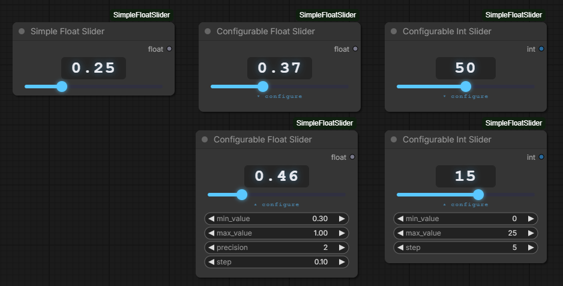
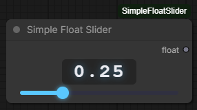
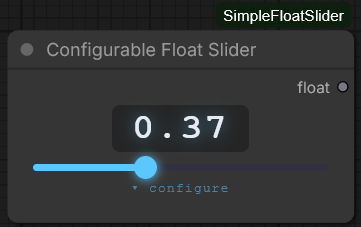
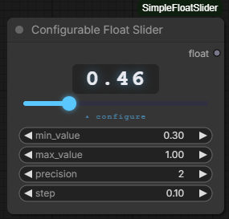
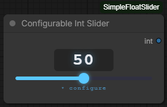
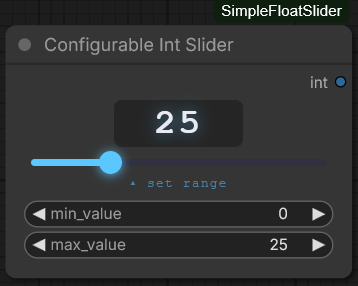

# ComfyUI Simple Float Slider

Three custom ComfyUI nodes that replace the default number widget with a styled, draggable slider and a prominent live value display.


---



---

## Nodes

### Simple Float Slider

A fixed-range slider with no configuration required.



| Widget | Type | Description |
|--------|------|-------------|
| `value` | slider | Drag to adjust. Click the number to type a value directly. |

| Output | Type | Description |
|--------|------|-------------|
| `float` | FLOAT | Current value, rounded to 2 decimal places |

- Range: `0.00` – `1.00`
- Step: `0.01`
- Precision: 2 decimal places

---

### Configurable Float Slider

A fully configurable slider. All settings update the slider live — no re-queuing needed. Configuration fields are hidden by default behind a `▾ configure` toggle.

 

| Widget | Type | Default | Description |
|--------|------|---------|-------------|
| `value` | slider | `0.5` | Drag to adjust. Click the number to type a value directly. |
| `min_value` | float | `0.0` | Lower bound of the slider range |
| `max_value` | float | `1.0` | Upper bound of the slider range |
| `precision` | int (0–4) | `2` | Number of decimal places shown in the display |
| `step` | float | `0.01` | Increment size when dragging or scrolling (revealed by `▾ configure`) |

| Output | Type | Description |
|--------|------|-------------|
| `float` | FLOAT | Current value, clamped to [min, max] and rounded to `precision` decimal places |

> **Note:** `precision` and `step` are independent. You can display 2 decimal places while stepping in increments of `0.25`, for example.

- See [Stepping](#stepping) for how `step` interacts with typed values.

---

### Configurable Int Slider

An integer slider with a configurable range and step size. Configuration fields are hidden by default to keep the node compact.

 

| Widget | Type | Default | Description |
|--------|------|---------|-------------|
| `value` | slider | `50` | Drag to adjust. Click the number to type a value directly. |
| `min_value` | int | `0` | Lower bound of the slider range (revealed by `▾ configure`) |
| `max_value` | int | `100` | Upper bound of the slider range (revealed by `▾ configure`) |
| `step` | int (≥1) | `1` | Increment size when dragging or scrolling (revealed by `▾ configure`) |

| Output | Type | Description |
|--------|------|-------------|
| `int` | INT | Current value, clamped to [min, max] |

- Click `▾ configure` to expand the min/max/step fields; click `▴ configure` to collapse them again.
- `step` is an integer of at least `1`, so the slider only ever moves in whole numbers.
- See [Stepping](#stepping) for how `step` interacts with typed values.

---

## Slider UI

All three nodes share the same widget style:

- **Large value display** — monospace, centered at the top of the node. Click it to type a value directly; press `Enter` to confirm or `Escape` to cancel.
- **Mouse wheel** — hover over the value display or anywhere on the slider track and scroll to nudge the value. Scroll up to increase, scroll down to decrease. All three nodes increment by their configured `step` size; the Simple Float Slider is fixed at `0.01`. The page canvas will not scroll while the pointer is over the slider.
- **Draggable range slider** — color-filled track: blue left of the thumb, dark right. The fill updates live as you drag.
- **Collapsible configuration** — the Configurable Float Slider and Configurable Int Slider both hide their settings fields behind a `▾ configure` toggle by default; click it to expand or collapse them.

---

## Stepping

Applies to the Configurable Float Slider and the Configurable Int Slider. In short: **you sit on the grid unless you deliberately type your way off it.**

- **Changing `step` re-grids.** Whenever you edit the `step` field, the current value snaps to the nearest multiple of the new step measured from `min_value`. So if you never type a value, the slider always lands on tidy multiples — `min`, `min + step`, `min + 2 × step` …
- **Typing sets the value exactly**, even if it doesn't sit on the grid. Type `37` on an int slider with `step` `5` and you get exactly `37`.
- **Dragging and scrolling step from wherever the value is.** Continuing the example, `37` moves to `42`, `47`, `52` … or `32`, `27` … — it does not jump onto the 35/40/45 grid. While the value *is* on the grid this is indistinguishable from stepping from `min`, which is why untouched sliders behave exactly as they always have.
- **`min_value` and `max_value` are always reachable.** Clamping happens after the step is applied, so a grid that would overshoot the bound still lets you land on it exactly.

To get back onto tidy multiples after typing an off-grid value, re-enter the `step` value — that re-grids from `min_value`.

---

## Installation

1. Clone or copy this folder into your ComfyUI `custom_nodes` directory:

```
ComfyUI/
└── custom_nodes/
    └── ComfyUI-SimpleFloatSlider/
        ├── __init__.py
        ├── nodes.py
        └── js/
            └── slider.js
```

2. Restart ComfyUI.

3. All three nodes appear under **utils/sliders** in the node search.

---

## Requirements

- ComfyUI (any recent version with custom node support)
- No additional Python packages required

---

## Changelog

### v1.1.2

- **Configurable Int Slider — new `step` widget** — sets how far the value moves when dragging or scrolling. Defaults to `1`, and is an integer of at least `1`, so the slider is always restricted to whole numbers. It sits alongside `min_value` and `max_value` in the collapsible configuration panel, mirroring the `step` widget the Configurable Float Slider already has.
  - Existing saved workflows load unchanged and pick up the default `step` of `1`.
- **Changed: stepping is now relative to the current value** — on both configurable sliders, typing a value sets it exactly even when it falls between steps, and dragging or scrolling then increments from *that* value. Typing `37` with `step` `5` moves to `42`/`32` rather than onto a fixed 35/40/45 grid. Editing the `step` field snaps the value back onto the nearest multiple measured from `min_value`, so a slider you never type into behaves exactly as it did before. See [Stepping](#stepping).
  - The slider thumb now always sits on the displayed value. Previously a typed value falling between steps left the thumb parked on the nearest step while the number read something else.
- **Configurable Int Slider — toggle renamed** — the `▾ set range` button is now `▾ configure`, matching the Configurable Float Slider. The old label no longer described the panel accurately now that it holds `step` as well as the range.

### v1.1.1

- **Fixed: saved settings were ignored when loading a workflow** — the Configurable Float Slider and Configurable Int Slider rebuilt themselves with their default range on load, so a saved `min_value`, `max_value`, `precision` or `step` had no effect on the slider until you nudged each field and moved it back. The configuration fields displayed the correct saved numbers the whole time, which made the mismatch easy to miss. The slider now reads the restored configuration once the workflow finishes loading.
- **Fixed: values outside the default range were lost on load** — because the slider still held its default bounds while the saved value was being restored, the value was clamped to those defaults. A node saved as `value: 7.5` with `max_value: 10.0` reloaded as `1.0`. The value is now clamped only against the configuration it was actually saved with.
  - Workflows already re-saved after being clamped have the reduced value stored on disk and cannot be recovered automatically.
- **Changed: narrowing a range is no longer destructive** — lowering `max_value` below the current value clamps the display as before, but raising it again restores the original value instead of leaving it stuck at the lower bound. Dragging, scrolling or typing a value still replaces it outright.

### v1.1.0

- **New node: Configurable Int Slider** — a styled integer slider under `utils/sliders`. Outputs `INT`. Defaults to range `0`–`100`.
  - Min and max are configurable directly on the node via a `▾ set range` toggle button that expands/collapses the range fields, keeping the UI clean during normal use.
- **Configurable Float Slider** — the four configuration fields (`min_value`, `max_value`, `precision`, `step`) are now hidden by default behind a `▾ configure` toggle button, consistent with the new int slider behaviour.
- **Mouse wheel support** — on all three nodes, hovering over the value display or the slider track and scrolling up/down increments or decrements the value. Scroll up increases the value, scroll down decreases it. The Configurable Float Slider steps by its configured `step` value; the Simple Float Slider steps by `0.01`; the Configurable Int Slider steps by `1`. The canvas will not scroll while the pointer is over the slider.
